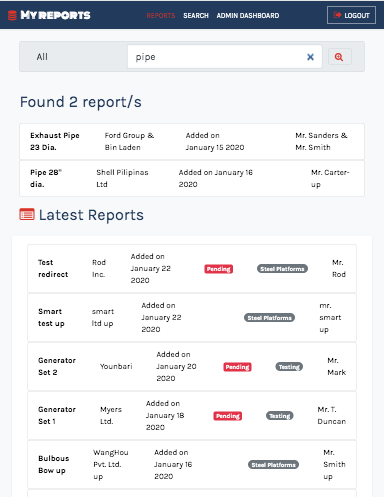

## A Database Report Web Application

# Features

- Advance Search
- Filter Reports search by categories
- Single report can include one image

# Users role

- Authentication
- Create reports
- Update Profile

# Administrator role

- Authentication and Authorization
- Create, Read, Update , Delete Reports
- Update Profile

# Tech stack

- React
- NodeJS
- MongoDB
- Express

## App Screenshots




## To run the app:

cd client
add.env file

```js
REACT_APP_API_URL = "your values";
```

then run:

```js
yarn start
```

cd server
add .env file

```js
DATABASE = "your values";
PORT = "your values";
JWT_SECRET = "your values";
```

then run:

```js
npm start
```
